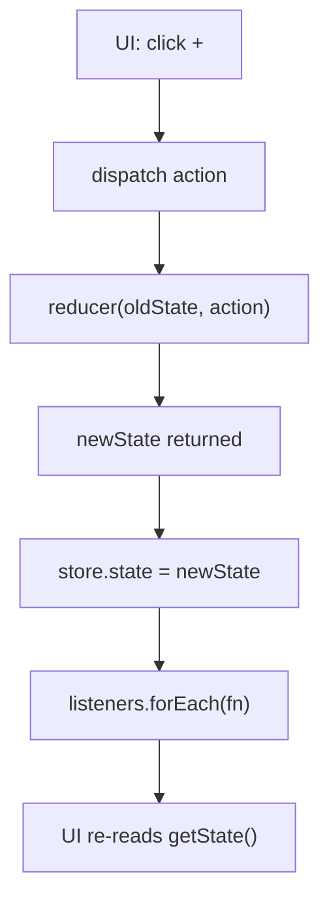

# Learn: Mini Redux (plain JS)

Code: `script.js` · Demo: `index.html`

Redux in one sentence: **one box of state**. You never edit the box by hand. You send an **action**, a **reducer** returns the next state, then **subscribers** update the UI.

---

## Pieces

| Piece | What it is |
|---|---|
| **Action** | Plain object: `{ type: 'INCREMENT' }` or `{ type: 'ADD', payload: 5 }` |
| **Reducer** | Pure function `(state, action) => newState` — switch + return |
| **Store** | Holds `state` + `listeners`. Exposes `getState`, `dispatch`, `subscribe` |
| **Subscribe** | “Call me after every dispatch.” Returns `unsubscribe` |

```
  createStore(reducer)
        │
        ▼
  ┌──────────────────────────────────────┐
  │  STORE (closure)                     │
  │                                      │
  │  private:  state, listeners[]        │
  │                                      │
  │  public:   getState()                │
  │            dispatch(action)          │
  │            subscribe(fn) → unsub     │
  └──────────────────────────────────────┘
```

---

## Startup (`@@INIT`)

```
  createStore(counterReducer)
          │
          ▼
  reducer(undefined, { type: '@@INIT' })
          │
          │  state param is undefined
          │  → default { value: 0 } kicks in
          │  → @@INIT hits default: return state
          ▼
  store's private state = { value: 0 }
```

That’s why you don’t pass initial state into `createStore` in this demo — the **reducer owns** it.

---

## Main flow (click +)

```
  button +
      │
      ▼
  dispatch({ type: 'INCREMENT' })
      │
      ▼
  ┌─────────────────────────────────────┐
  │ 1. reducer(oldState, action)        │
  │    { value: 0 } + INCREMENT         │
  │    → return { value: 1 }            │
  └─────────────────────────────────────┘
      │
      ▼
  ┌─────────────────────────────────────┐
  │ 2. store saves new state            │
  │    state = { value: 1 }             │
  └─────────────────────────────────────┘
      │
      ▼
  ┌─────────────────────────────────────┐
  │ 3. notify every listener            │
  │    render() → update #count         │
  │    log()    → prepend to #log       │
  └─────────────────────────────────────┘
```



---

## Who talks to whom

```
                    ┌────────────┐
                    │   Action   │
                    │ { type }   │
                    └─────┬──────┘
                          │
                          ▼
  ┌──────────┐     ┌────────────┐     ┌──────────┐
  │    UI    │────▶│   Store    │────▶│ Reducer  │
  │ dispatch │     │ getState   │     │ switch   │
  │subscribe │◀────│ listeners  │◀────│ return   │
  └──────────┘     └────────────┘     └──────────┘
       ▲                  │
       │                  │ notify
       └──────────────────┘
```

- UI **never** does `state.value++`
- UI only: `dispatch` / `getState` / `subscribe`
- Reducer **never** touches the DOM

---

## Subscribe / unsubscribe

```
  subscribe(render)
       │
       ▼
  listeners = [ render, logFn, ... ]

  dispatch(...)  →  call every fn in listeners

  unsubscribe()  →  remove render from listeners
                     (count label freezes; other listeners still run)
```

```
  before:  listeners = [ render, logFn ]
  after unsub render:
           listeners = [ logFn ]
```

---

## Reducer shape (reminder)

```js
function counterReducer(state = { value: 0 }, action) {
  switch (action.type) {
    case 'INCREMENT':
      return { value: state.value + 1 } // NEW object
    default:
      return state
  }
}
```

Not the store. The store **calls** this.

---

## Map to real Redux / React

| This demo | Real world |
|---|---|
| `createStore` | `createStore` or RTK `configureStore` |
| `dispatch` + `subscribe(render)` | `dispatch` + `useSelector` (react-redux subscribes for you) |
| `counterReducer` | slice reducer / `createSlice` |
| manual `#count` update | React re-render |

Interview one-liner:

> “UI dispatches an action → reducer returns new state → store saves it → subscribers run. Same idea as Redux; React-Redux is just a subscriber.”

---

## Not in this mini version

Middleware (thunk), `combineReducers`, DevTools, Immer / RTK Query.


LINKS:
https://www.youtube.com/watch?v=dYMa-B2WX28
