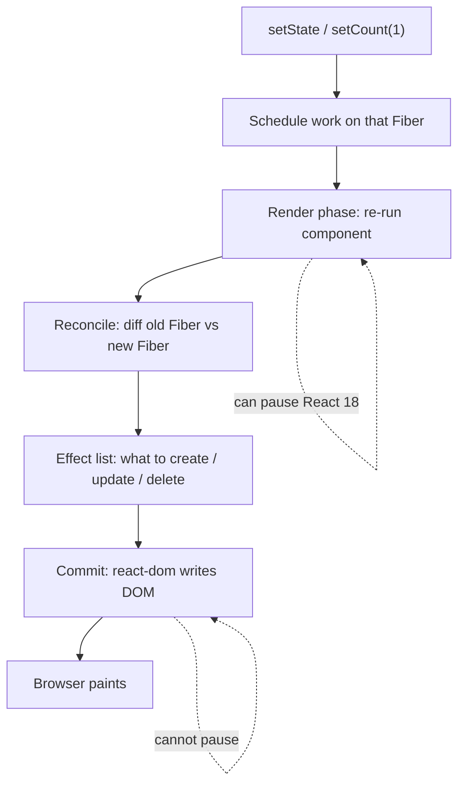

2️⃣ React Internals
What actually happens when state changes in React? Explain the flow through reconciliation → Fiber → render phase → commit phase → DOM update.

Ans.

**Links (keep / watch these)**

- https://www.youtube.com/watch?v=i793Qm6kv3U
- https://www.youtube.com/watch?v=qeooCIQMF0U (WATCH LATER)
- https://www.youtube.com/watch?v=OQYsHvEq7nE&list=PLC3y8-rFHvwg7czgqpQIBEAHn8D6l530t
- https://www.youtube.com/watch?v=MPCVGFvgVEQ
- https://github.com/acdlite/react-fiber-architecture
- https://www.youtube.com/watch?v=YP2f-ErXG_M&list=PLC3y8-rFHvwg7czgqpQIBEAHn8D6l530t&index=1
- **Must read:** https://react.dev/learn/render-and-commit — official, same words as the question
- **Fiber cartoon (best video):** https://www.youtube.com/watch?v=ZCuYPiUIONs — Lin Clark. Fiber = pause work.
- Extra: https://www.developerway.com/posts/react-re-renders-guide

---

## Definitions

**Virtual DOM**  
A JS description of the UI (`<button>1</button>` as objects). React still builds this. Fiber did **not** replace it.

**Reconciliation**  
The **job**: compare old tree vs new tree → create / update / delete.

**Reconciliation algorithm**  
The **rules** for that job:

- same type (`button` → `button`) → update in place
- different type (`button` → `p`) → throw away, create new
- lists → match by `key`

**Fiber (the node)**  
A **JS object** per component — the unit of work (type, props, state, child, sibling, parent). Not an algorithm.

**Fiber reconciler**  
The **engine** (React 16+). Walks Fiber nodes, applies those rules, can **pause**. Replaced the old **stack reconciler** (recursive, all-or-nothing). Did **not** replace the virtual DOM.

**Render phase**  
Thinking. Re-run components, diff Fibers, build a list of effects. **Can pause** (React 18 concurrent). Screen does not change yet.

**Commit phase**  
Doing. Walk the effect list, ask **`react-dom`** to patch the real DOM. **Cannot pause**. Then the **browser paints**.

**Who marks a fiber “dirty”?**  
`setCount` / `setState` — React’s setter. It enqueues an update on that fiber and schedules work. Fibers already exist from mount; the click does not create Fiber.

```
Reconciliation     = what (the job / the rules)
Fiber              = the object React walks
Fiber reconciler   = how (current implementation)
react-dom          = writes the real DOM
browser            = paints pixels
```

One sentence: *The Fiber reconciler is React’s current implementation of the reconciliation algorithm; it runs on Fiber nodes.*

---

## Why Fiber exists

Goal: animation, layout, gestures. Headline: **incremental rendering** — split work into chunks across frames.

- pause work and come back later
- assign priority to different updates
- reuse previously completed work
- abort work if it’s no longer needed

You never hand a “diff object” to ReactDOM. Fiber **calls** the renderer. `react-dom` knows `createElement` / `textContent`. Same Fiber + `react-native` = different host.

---

## Flow (click → screen)

```js
<button onClick={() => setCount(count + 1)}>{count}</button>
```

Screen shows `0`. You click.

```
  click setCount(1)
          │
          ▼
  ┌─────────────────────────────────┐
  │ 1. STATE                        │
  │ count = 1 in memory             │
  │ fiber marked as needing work by setCount │
  │ screen still 0                  │
  └─────────────────────────────────┘
          │
          ▼
  ┌─────────────────────────────────────────────────────┐
  │ 2. RENDER PHASE  (can pause)                        │
  │                                                     │
  │  re-runs Counter()                                  │
  │       │                                             │
  │       ▼                                             │
  │  VIRTUAL DOM (new)                                  │
  │  React elements: <button>1</button>                 │
  │  (JS description of what UI should look like)       │
  │       │                                             │
  │       ▼                                             │
  │  FIBER RECONCILER                                   │
  │  walks Fiber nodes + runs RECONCILIATION ALGO       │
  │  (rules: same type? key? create/update/delete)      │
  │  diffs old Fiber tree vs new elements               │
  │       │                                             │
  │       ▼                                             │
  │  plan / effect list: "text 0 → 1"                   │
  │  screen still 0                                     │
  └─────────────────────────────────────────────────────┘
          │
          ▼
  ┌─────────────────────────────────┐
  │ 3. COMMIT PHASE  (cannot pause) │
  │ react-dom patches the real DOM  │
  │ then browser paints             │
  │ screen now 1                    │
  └─────────────────────────────────┘
```

Where they sit:

- **Virtual DOM** = the element tree from re-running the component (`<button>1</button>`). What to show.
- **Reconciliation algorithm** = the rules used while diffing (same type / key / replace).
- **Fiber reconciler** = the engine that applies those rules on Fiber nodes during render. Like: walk Counter’s fiber → see child is still `button` (same type) → only text changed → write effect “update text 0 → 1”. Not writing the DOM yet — just planning.



| Step | Their word | What happens | Screen |
|---|---|---|---|
| 1 | state change | `count` is 1 in memory. That fiber scheduled. | still `0` |
| 2 | Fiber | Private tree: one JS object for Counter, one for button. Already existed. | still `0` |
| 3 | render phase | React **calls** `Counter()` again. Gets `<button>1</button>`. | still `0` |
| 4 | reconciliation | Diff: same `<button>`, only **text** changed. Plan: edit text node. | still `0` |
| 5 | commit + DOM | `react-dom` writes `"1"`. Browser paints. | now `1` |

Render/reconcile = **thinking**. Commit/DOM = **doing**. If commit paused, you’d see a half-updated page.

---

## Example: same type vs type change

```js
// same type → update in place (keep the DOM node, change text)
<button>0</button>  →  <button>1</button>

// type change → throw away, create new
<button>Save</button>  →  <p>Saved</p>
```

```
  old:  button "0"          new:  button "1"
           │                       │
           └──── same type ────────┘
                    │
                    ▼
              update text node only
              (cheap)

  old:  button "Save"       new:  p "Saved"
           │                       │
           └── different type ─────┘
                    │
                    ▼
              delete button, create p
```

---

## Virtual DOM vs Fiber (don’t mix these)

```
  Your JSX
      │
      ▼
  Element tree          ← "virtual DOM" (what to show)
      │
      ▼
  Fiber tree            ← how React walks / pauses that work
      │
      ▼
  react-dom             ← real DOM
      │
      ▼
  Browser paint
```

“Virtual DOM is *what* we compare. Fiber is *how* React schedules that comparison so it can pause. Fiber replaced the stack reconciler, not the virtual DOM.”

---

## 30-second answer (memorize this)

“`setState` does not edit the page. React first **re-runs my component** (render). It **diffs** the old tree vs the new tree on **Fibers** — that’s reconciliation. Then in **commit** it copies only the diff onto the **DOM**, then the browser paints. Fiber is just React’s JS object per component so it can pause that thinking. Re-render ≠ rebuild the whole HTML.”

## Close

“Notebook then house. Fiber/render/reconcile = notebook. Commit/DOM = builders update the house. That’s why a re-render is cheap compared to innerHTML on the whole page.”
